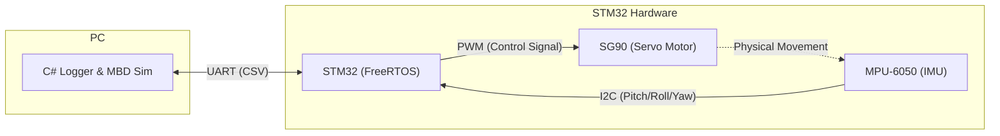
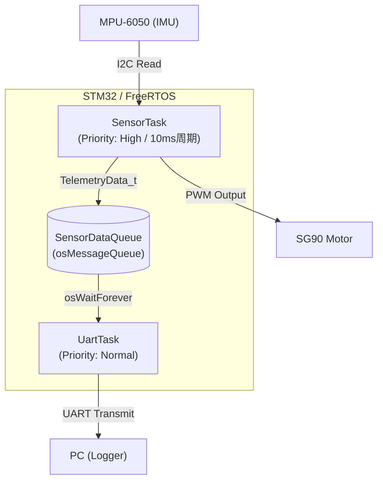
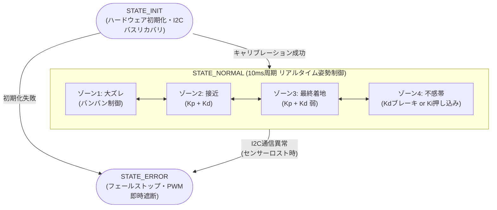

# MobilityDynamicsSystem

  
   
  <strong>STM32とFreeRTOSによるリアルタイム姿勢制御システム</strong> 
  <i>外乱に対しても速やかに水平に復帰します。</i>

## 1. Background
将来的なモビリティ制御（船舶、建機、次世代エンジン等）や重厚長大産業における制御システム開発へのキャリアチェンジを見据え、**「机上シミュレーションと実機の適合」** を個人で一気通貫して経験するために開発したプロジェクトです。

ソフトウェアエンジニアとしての強み（C#によるツール開発やデータ解析）を活かし、単なる「動いた」で終わらせず、シミュレータによる制御則の検証、ハードウェア制約を考慮した安全設計、そしてオシロスコープ等の専用計器に頼らない自律的なデバッグ環境の構築に挑戦しています。

## 2. Requirements
本開発において、以下の要件を満たす制御システムの構築を目指しました。
1. **外乱抑制:** ステップ応答時のオーバーシュートを最小限に抑え、速やかに目標角度へ整定すること。
2. **安定性の確保:** 微小な定常偏差を追従するためのハンチングを防止し、システム全体を安定化させること。
3. **フェールセーフ:** センサ異常や通信断絶などの異常時には、物理的な暴走を防ぐため即座に出力を遮断すること。

## 3. Architecture

* **MCU:** STM32 NUCLEO-F401RE (C言語 / FreeRTOS / CMSIS-V2)
* **Sensors/Actuators:** MPU-6050 (6軸IMU) / SG90 (サーボモーター)
* **Visualization:** C# Windows Forms + ScottPlot (100Hzリアルタイム波形ロガー)
* **Simulation:** Python / Jupyter Notebook (プラントモデル構築・パラメータ探索)

<b>詳細なシステム設計（タスク構成図・状態遷移図）</b>

**■ RTOS タスク・キュー設計** 
10msの厳格な制御周期を維持するため、I2Cセンサ読み取りとPID演算を最優先タスク（High）で実行。時間のかかるUART送信処理は `osMessageQueue` を介して通常優先度タスク（Normal）へ逃がす、リアルタイム性を重視した非同期ロギングを実装しています。

**■ システム状態遷移とフェールセーフ機構** 
システム全体をステートマシンで管理。正常稼働時（`STATE_NORMAL`）は未来の誤差予測量に基づいて4つの制御ゾーンをシームレスに遷移します。通信異常などを検知した際は即座に `STATE_ERROR` へ移行し、ハードウェアタイマーのPWM出力を完全停止（フェールストップ）させて暴走を防ぎます。

## 4. Technical Highlights

### 4.1 実機データに基づくシステム同定
データシートに記載のない摩擦やバックラッシュなどの物理パラメータを特定するため、自作のC#可視化ツールで取得した実機ログデータ（CSV）を活用し、システム同定を行いました。

  <!-- 画像挿入位置：LogToolのUI画像 -->
  
   
  <i>自作のC#ダッシュボード</i>

STM32から115200bpsで送信されるテレメトリデータを100Hzでリアルタイム描画し、解析用CSVの出力を行うことが可能です。
シミュレータ上で仮定した物理特性と、実機のログ波形とのズレを定量的に分析し、以下のパラメータを最適化しています。
* **時定数 ($\tau$):** オープンループでのステップ応答から63.2%到達時間を実測。
* **むだ時間:** PWM指令変化からIMU角速度立ち上がりまでの制御ループ数を計測。
* **摩擦・バックラッシュ:** 実機の自由落下ログとPythonシミュレータの波形が一致するようにカーブフィッティングを実施。

### 4.2 位置型PIDから「速度型制御」への移行
**【課題】**
標準的な位置型PIDでは、目標値への到達速度( $K_p$ )と発振抑制( $K_d$ )のトレードオフにより、適切なチューニングが困難でした。

**【解決策】**
未来の誤差予測量に基づいて制御領域を4つの「ゾーン」に分割し、出力値を「操作量の増分」とする**速度型ハイブリッド制御**を実装しました。
1. **大ズレ時:** バンバン制御（最大出力）で一気に接近。
2. **接近フェーズ:** 高い $K_p$ ゲインで目標値に寄せる。
3. **最終着地フェーズ:** $K_p$ ゲインを落としてソフトランディング。
4. **不感帯内:** 積分制御（ $K_i$ ）のみで最終的な定常偏差を押し切る。

### 4.3 実機とシミュレーションの適合検証
上記で構築した制御アルゴリズムを実機に適用し、ステップ応答の適合性を検証しました。

  
   
  <i>図1: 15度のステップ応答テスト</i>

図1の上段のピッチ角グラフが示す通り、実機（緑）はシミュレーション（青）と同様にオーバーシュートなしで滑らかに整定しています。 
下段のPWMグラフにおいて定常的なズレが見られますが、これはハードウェアの個体差や組み付け時の微細な重力負荷の違いによるモデル誤差です。 
制御アルゴリズムがこの物理的な誤差を吸収し、目標角度へ正確に収束させていることが確認できます。

### 4.4 パラメータ変動に対するロバスト性の検証
ハードウェアの経年劣化や個体差を想定し、シミュレータ上でモーターの時定数($\tau$)を意図的に変動させるストレステストを実施しました。

  <!-- 画像挿入位置：未来予測オンのロバスト性検証画像 -->
  
   
  <i>図2: 予測アルゴリズムによるロバスト性検証</i>

図2から、モーターの時定数 $\tau$ が変動（0.04〜0.15）する条件下でもハンチングせずに整定していることが分かります。 
未来予測アルゴリズムと速度型制御を協調させることで、通常であればハンチングを引き起こす高いゲイン設定においても、環境変動に強いロバスト性を実現しています。

### 4.5 追従性と安定性のトレードオフ設計
連続的なサイン波を用いたトラッキングテストを実施し、特定角度への過学習がないかを検証しました。

  <!-- 画像挿入位置：sin波追従のテスト画像 -->
  
   
  <i>図3: サイン波追従テスト</i>

図3から、安定して目標値に追従していることが分かります。 
波形頂点が平坦になっているのは、このハードウェアの限界に起因する激しいハンチングを防ぐため、あえて微小角での追従遅れを許容したトレードオフの結果です。 
実機波形の分析から、ギアのバックラッシュが約1.5度存在するため、余裕を持たせた2.0度を不感帯のしきい値に設定しています。

### 4.6 ハードウェア制約への対応とトラブルシューティング
* **数学的検証とフェールセーフ:** ジンバルの異常挙動に対し、ピッチ角算出式の数学的誤りを特定・修正。異常検知時にはPWM出力を即座に遮断するフェールストップ機構を実装。
* **I2Cバスリカバリ:** SDAラインのスタック不具合に対し、GPIOを用いたbit-bangingによるバス復帰ロジックを実装。
* **クローンチップへの適応:** 互換チップ（ID: 0x70）のWHO_AM_Iレジスタ仕様を特定し、初期化シーケンスを改修。

## 5. Repository Structure
* `/Firmware/` - STM32CubeIDEプロジェクト (C言語 / FreeRTOS / HAL)
* `/Software/` - リアルタイム可視化・ロギングツール (C# / Windows Forms / ScottPlot)
* `/Simulation/` - MBDシミュレータとシステム同定 (Python / Jupyter Notebook / Pandas)

## 6. Future Work
* **非線形摩擦モデルの統合:** LuGreモデル等を組み込み、シミュレータの再現性を向上させる。
* **アクチュエータの刷新:** BLDCモーター等へ換装し、物理的な追従限界を突破する。
* **状態推定の高度化:** 相補フィルタからカルマンフィルタへ移行し、姿勢計算を堅牢化する。

### License
This project is licensed under the MIT License.
