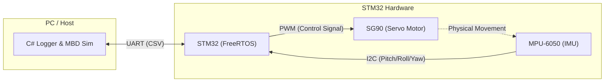

# MobilityDynamicsSystem

  
   
  <strong>STM32とFreeRTOSによるリアルタイム姿勢制御システム</strong> 
  <i>外乱に対しても速やかに水平に復帰します。</i>

---

## 📖 Background & Motivation
将来的なモビリティ制御（船舶、建機、次世代エンジン等）や重厚長大産業における制御システム開発へのキャリアチェンジを見据え、**「机上シミュレーションと実機の適合」** を個人で一気通貫して経験するために開発したプロジェクトです。

ソフトウェアエンジニアとしての強み（C#によるツール開発やデータ解析）を活かし、単なる「動いた」で終わらせず、シミュレータによる制御則の検証、ハードウェア制約を考慮した安全設計、そしてオシロスコープ等の専用計器に頼らない自律的なデバッグ環境の構築に挑戦しています。

## 🎯 System Requirements (目標要件)
本開発において、以下の要件を満たす制御システムの構築を目指しました。
1. **外乱抑制:** ステップ応答時のオーバーシュートを最小限に抑え、速やかに目標角度へ整定すること。
2. **安定性の確保:** 微小な定常偏差を追従するための過剰なハンチング（不感帯での発振）を防止し、システム全体を安定化させること。
3. **フェールセーフ:** センサ異常や通信断絶などの異常時には、物理的な暴走を防ぐため即座に出力を遮断すること。

## 🛠 System Architecture

* **MCU:** STM32 NUCLEO-F401RE (C言語 / FreeRTOS / CMSIS-V2)
* **Sensors/Actuators:** MPU-6050 (6軸IMU) / SG90 (サーボモーター)
* **Visualization:** C# Windows Forms + ScottPlot (100Hzリアルタイム波形ロガー)
* **Simulation:** Python / Jupyter Notebook (プラントモデル構築・パラメータ探索)

---

## 🚀 Key Engineering Highlights

### 1. 実機データに基づくシステム同定
データシートに記載のない摩擦やバックラッシュなどの物理パラメータを特定するため、自作のC#可視化ツールで取得した実機ログデータ（CSV）を活用し、システム同定を行いました。

  
   

* **時定数 ($\\tau$):** オープンループでのステップ応答から63.2%到達時間を実測。
* **むだ時間:** PWM指令変化からIMU角速度立ち上がりまでの制御ループ数を計測。
* **摩擦・バックラッシュ:** 実機の自由落下ログとPythonシミュレータの波形が一致するようにカーブフィッティングを実施。

### 2. 位置型PIDから「速度型制御」への移行
**【課題】**
標準的な位置型PIDでは、目標値への到達速度( $K_p$ )と発振抑制( $K_d$ )のトレードオフにより、適切なチューニングが困難でした。

**【解決策】**
未来の誤差予測量に基づいて制御領域を4つの「ゾーン」に分割し、出力値を「操作量の増分」とする**速度型ハイブリッド制御**を実装しました。
1. **大ズレ時:** バンバン制御（最大出力）で一気に接近。
2. **接近フェーズ:** 高い $K_p$ ゲインで目標値に寄せる。
3. **最終着地フェーズ:** $K_p$ ゲインを落としてソフトランディング。
4. **不感帯内:** 積分制御（ $K_i$ ）のみで最終的な定常偏差を押し切る。

### 3. むだ時間補償とロバスト性の検証
システムのむだ時間による位相遅れを補償するため、現在の角速度から **「遅延の間に進んでしまう未来の誤差」を予測してゾーン判定を行う**アルゴリズムを実装しました。

  
   
  <i>図1: 予測アルゴリズムによるロバスト性検証。モーターの時定数 $\\tau$ が変動（0.04〜0.15）する条件下でも発振せずに整定している。</i>

予測アルゴリズムと協調させることで、通常であれば発振を引き起こす高いゲイン設定においても、モーターの個体差や経年劣化（時定数 $\\tau$ の変動）に強い驚異的なロバスト性を実現しています。

### 4. 追従性と安定性のトレードオフ
連続的なサイン波を用いたトラッキングテストを実施し、特定角度への過学習がないかを検証しました。

  
   
  <i>図2: サイン波追従テスト。安定して目標値に追従している。</i>

図2の波形頂点が平坦になっているのは、不感帯内での激しいハンチング（発振）を防ぐためのゲイン調整の結果です。あえて微小角での追従遅れを許容し、システムの安定化を最優先した安全設計を採用しています。

### 5. ハードウェア制約への対応とトラブルシューティング
* **数学的検証とフェールセーフ:** ジンバルの異常挙動に対し、ピッチ角算出式の数学的誤りを特定・修正。異常検知時にはPWM出力を即座に遮断するフェールストップ機構を実装。
* **I2Cバスリカバリ:** SDAラインのスタック不具合に対し、GPIOを用いたbit-bangingによるバス復帰ロジックを実装。
* **クローンチップへの適応:** 互換チップのWHO_AM_Iレジスタ仕様を特定し、初期化シーケンスを改修。

---

## 📂 Repository Structure
* `/Firmware/` - STM32CubeIDEプロジェクト (C言語 / FreeRTOS / HAL)
* `/PC_Tools/` - リアルタイム可視化・ロギングツール (C# / Windows Forms / ScottPlot)
* `/Simulation/` - MBDシミュレータとシステム同定 (Python / Jupyter Notebook / Pandas)

---

## 🔮 Future Work
* **非線形摩擦モデルの統合:** LuGreモデル等を組み込み、シミュレータの再現性を向上させる。
* **アクチュエータの刷新:** BLDCモーター等へ換装し、物理的な追従限界を突破する。
* **状態推定の高度化:** 相補フィルタからカルマンフィルタへ移行し、姿勢計算を堅牢化する。

---

### License
This project is licensed under the MIT License.
